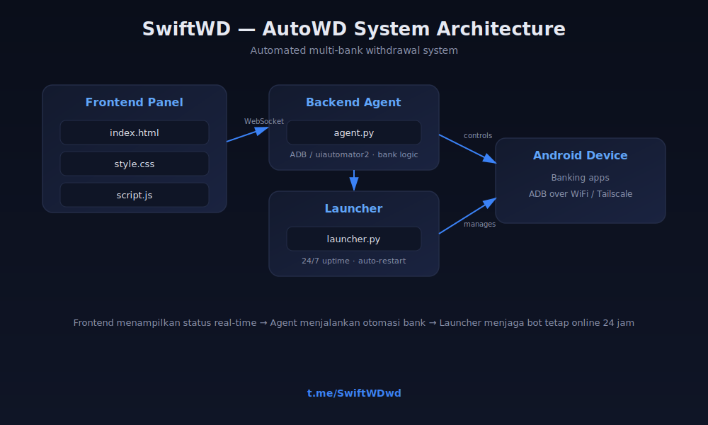

# SwiftWD — Automated Withdrawal System

Sistem otomasi withdrawal perbankan multi-panel, real-time, dan berjalan 24 jam.

## Tentang

SwiftWD adalah sistem otomasi withdrawal yang menghubungkan panel, aplikasi perbankan, dan monitoring real-time dalam satu arsitektur yang stabil dan mudah dipantau.

## Struktur Proyek

| File | Fungsi |
|---|---|
| `index.html` | Struktur tampilan dashboard panel |
| `style.css` | Styling dan tema dashboard |
| `script.js` | Interaksi frontend & koneksi real-time |
| `agent.py` | Backend otomasi — menjalankan logika transaksi ke aplikasi bank |
| `launcher.py` | Menjaga bot tetap berjalan 24 jam, auto-restart bila terputus |

## Alur Kerja

1. **Frontend** menampilkan status transaksi secara real-time
2. **Agent** menjalankan otomasi ke aplikasi bank melalui perangkat Android
3. **Launcher** memastikan proses tetap online tanpa henti, 24 jam penuh

## Fitur Utama

- Proses withdrawal otomatis, cepat, tanpa input manual
- Mendukung multi-panel dan multi-bank dalam satu sistem
- Monitoring real-time
- Sistem device management untuk koneksi yang stabil
- Berjalan otomatis 24 jam

## Kontak

Untuk informasi, konsultasi, atau kerja sama:

**Telegram: [@SwiftWDwd](https://t.me/SwiftWDwd)**

---
© 2026 SwiftWD. All rights reserved.
